# LƯỜI BUSINESS OS — Master Product Roadmap

## Vision
**LƯỜI BUSINESS OS** is an enterprise-grade Customer 360 & Operations Platform tailored for Vietnamese businesses. It unifies the end-to-end customer journey:
`60 Fanpages / Zalo / WhatsApp / Webchat / Form` → `1 Unified CRM` → `Data Classification & Routing` → `Customer Care & SLA` → `Remarketing & Multi-Platform CAPI` → `Attribution & P&L per Page`.

> **Scope Note**: VTtech Chrome Extension is a standalone external tool and is strictly excluded from LƯỜI CMS core scope.

---

## Phase Overview & Milestones

```mermaid
flowchart LR
    P0[Phase 0: Foundation & Core] --> P1[Phase 1: CMS & Brand Hub]
    P1 --> P2[Phase 2: Sites & Multi-CAPI Tracking]
    P2 --> P3[Phase 3: Customer 360 & CRM]
    P3 --> P4[Phase 4: Omnichannel Inbox]
    P4 --> P5[Phase 5: OpenClaw & OmniRoute]
    P5 --> P6[Phase 6: Workflows & Approvals]
    P6 --> P7[Phase 7: Analytics & Attribution]
    P7 --> P8[Phase 8: Production Release]
```

---

### Phase 0 — Foundation & System Architecture (Completed)
- [x] Repository audit & architectural specification
- [x] Setup comprehensive documentation (`docs/*`, `TASKS.md`, `CHANGELOG.md`)
- [x] Implement Workspace Scoping & 9-Tier RBAC Engine (`src/lib/rbac.ts`)
- [x] Implement Append-Only Audit Logging Engine (`src/lib/audit.ts`)
- [x] Implement AES-256-GCM Secret Encryption (`src/lib/crypto.ts`)
- [x] Implement OmniRoute Model Gateway Client & 6 Routing Profiles (`src/lib/omniroute.ts`)
- [x] Implement OpenClaw Agent Sidecar Adapter (`src/lib/openclaw.ts`)
- [x] Implement Business MCP Hub Namespace Registry & Handlers (`src/lib/mcp-hub.ts`)
- [x] Implement Approval Center Engine & Policies (`src/lib/approval.ts`)
- [x] Implement Customer 360 Identity Resolution Engine (`src/lib/identity-resolution.ts`)
- [x] System Health & Diagnostics Endpoints (`/api/system/health`)

### Phase 1 — Lười CMS & Taxonomy SEO Hub (In Progress)
- [x] Brand & Product catalog models (Products, Variants, Categories, Shortcodes)
- [x] **Category Taxonomy Full SEO Engine**: SEO Title, SEO Description, Canonical URL, OG Image, JSON-LD Schema (`/admin/categories`)
- [ ] Content Library & Media Asset quarantine pipeline
- [ ] Multi-version publishing with approval hooks

### Phase 2 — Lười Sites & Multi-Platform Ad CAPI (In Progress)
- [x] **Visual Studio / Puck Builder with Full SEO Suite**: SEO Title, Description, OG Image, Canonical, Keywords, NoIndex, SERP Preview (`/admin/pages/[id]/builder`)
- [x] Form Builder with Server-side validation, rate limiting & anti-spam
- [x] **Meta Conversions API (CAPI) Multi-Stage Protocol**:
  - `CompleteRegistration`: Realtime web/landing page form submission
  - `Lead`: Triggered on Qualify/Schedule/Checkin status in CRM
  - `Purchase`: Triggered on actual in-store payment (`actualRevenue` in VND)
- [x] **Google Ads AI Learning & Server-Side OCI Engine**:
  - Enhanced Conversions for Web with SHA-256 hashed phone (+84/E.164) & email
  - Multi-Click ID tracking: `gclid`, `gbraid`, `wbraid`
  - Offline Conversion Import (OCI) payload builder for Lead, Schedule, Purchase (`src/lib/google-ads.ts`)
- [ ] Embedded Web Chat Widget SDK (Lightweight, async, consent-aware)

### Phase 3 — Customer 360 & Unified CRM (In Progress)
- [x] Unified Customer Profile UI & Data Schema (`CRMLead`, `CRMStatusHistory`)
- [x] Automatic VN Phone Number Normalization & SHA-256 Hash
- [x] Google Sheets TDS Parser 2-way sync (DATHEN & Telesale checkin sheets)
- [x] Multi-Filter CRM Dashboard (Telesale, Branch, Service, Revenue, Date ranges)
- [ ] Customer 360 Timeline Event Stream (Multi-Page touchpoints, chat history, revenue)
- [ ] Automated Lead Deduplication & Multi-Opportunity merge rules

### Phase 4 — Omnichannel Inbox & Connectors (In Progress)
- [x] Meta Webhook Receiver (LeadGen & CAPI)
- [x] Telegram Bot Webhook & Incident Dispatcher
- [x] Omnichannel Intent Analysis & Insights Dashboard (`/admin/omnichannel`)
- [ ] Realtime Websocket Omnichannel Live Chat Inbox UI
- [ ] Zalo OA Official API Connector
- [ ] WhatsApp Business Cloud API Connector

### Phase 5 — OpenClaw, OmniRoute & Business MCP Hub Integration (In Progress)
- [x] OmniRoute Gateway Client & Fallback profiles
- [x] OpenClaw Sidecar Client & Session runner
- [x] Business MCP Hub tool handlers (`customer.*`, `cms.*`)
- [ ] System Prompt Template Library with Brand Voice Enforcement

### Phase 6 — Workflows & Approval Center (In Progress)
- [x] Approval Center Engine & Policies
- [x] Sensitive action interceptors (Permissions, Roles, Logs)
- [ ] Automated SLA Alert Workflow to Telegram when new lead > 15m unhandled

### Phase 7 — Lười Analytics & Attribution per Page (In Progress)
- [x] Meta Ads Daily Stat Tracker (`/admin/meta-ads`)
- [x] Revenue & Conversion breakdown by Channel / Telesale / Branch
- [ ] **P&L and Real ROAS per Fanpage**: Cost Ad Spend vs Actual Revenue per Page across 60 Fanpages

### Phase 8 — Production Hardening & Deployment (In Progress)
- [x] VPS Deployment Scripts & Docker Compose setup
- [x] Build verification & automated TypeScript validation
