# LƯỜI BUSINESS OS — Master Product Roadmap

## Vision
**LƯỜI BUSINESS OS** is an enterprise-grade Customer 360 & Operations Platform tailored for Vietnamese businesses. It unifies the end-to-end customer journey:
`Anonymous Visitor` → `Content Consumer` → `Form/Chat Lead` → `Sales Assignment` → `Consultation & Quote` → `Order Conversion` → `Post-Purchase Support` → `Retention & Referral`.

---

## Phase Overview & Milestones

```mermaid
flowchart LR
    P0[Phase 0: Foundation & Core] --> P1[Phase 1: CMS & Brand Hub]
    P1 --> P2[Phase 2: Sites & Web Tracking]
    P2 --> P3[Phase 3: Customer 360 & CRM]
    P3 --> P4[Phase 4: Omnichannel Inbox]
    P4 --> P5[Phase 5: OpenClaw & OmniRoute]
    P5 --> P6[Phase 6: Workflows & Approvals]
    P6 --> P7[Phase 7: Analytics & Attribution]
    P7 --> P8[Phase 8: Production Release]
```

---

### Phase 0 — Foundation & System Architecture (In Progress)
- [x] Repository audit & architectural specification
- [x] Setup comprehensive documentation (`docs/*`, `TASKS.md`, `CHANGELOG.md`)
- [ ] Implement Workspace Scoping & 9-Tier RBAC Engine (`src/lib/rbac.ts`)
- [ ] Implement Append-Only Audit Logging Engine (`src/lib/audit.ts`)
- [ ] Implement AES-256-GCM Secret Encryption (`src/lib/crypto.ts`)
- [ ] Implement OmniRoute Model Gateway Client & 6 Routing Profiles (`src/lib/omniroute.ts`)
- [ ] Implement OpenClaw Agent Sidecar Adapter (`src/lib/openclaw.ts`)
- [ ] Implement Business MCP Hub Namespace Registry & Handlers (`src/lib/mcp-hub.ts`)
- [ ] Implement Approval Center Engine & Policies (`src/lib/approval.ts`)
- [ ] Implement Customer 360 Identity Resolution Engine (`src/lib/identity-resolution.ts`)
- [ ] System Health & Diagnostics Endpoints (`/api/system/health`)

### Phase 1 — Lười CMS & Brand Hub
- [ ] Brand & Product catalog models (Products, Variants, Services, Offers)
- [ ] Persona & Audience definitions
- [ ] Campaign & Content Calendar management
- [ ] Content Library & Media Asset quarantine pipeline
- [ ] Multi-version publishing with approval hooks

### Phase 2 — Lười Sites & Web Tracking
- [ ] Block-based Landing Page Builder (Puck-based with custom schemas)
- [ ] Form Builder with Server-side validation, rate limiting & anti-spam
- [ ] Embedded Web Chat Widget SDK (Lightweight, async, consent-aware)
- [ ] First-touch & Last-touch UTM Attribution Tracker
- [ ] Server-Side Meta CAPI / Conversion API Event Adapters

### Phase 3 — Customer 360 & Unified CRM
- [ ] Unified Customer Profile UI & Data Schema
- [ ] Automatic VN Phone Number Normalization & Identity Merging
- [ ] Timeline Event Stream (Page views, Form fills, Chats, Orders, Tickets)
- [ ] Lead Management, Pipelines & Stage Transition Rules
- [ ] Báo giá (Quotes), Đơn hàng (Orders) & Lịch hẹn (Appointments) tracking

### Phase 4 — Omnichannel Inbox & Connectors
- [ ] Unified Omnichannel Conversation Store & Realtime Websocket Sync
- [ ] Connector 1: Web Form Receiver
- [ ] Connector 2: Embedded Web Chat SDK Receiver
- [ ] Connector 3: Telegram Bot Official API Adapter
- [ ] Connector 4: Zalo OA Official API Adapter
- [ ] Connector 5: Meta Messenger / Fanpage Official API Adapter
- [ ] Connector 6: Pancake Webhook & API Adapter
- [ ] Connector 7: WhatsApp Business Platform Official API Adapter
- [ ] Agent-to-Human Handoff & SLA Escalation Engine

### Phase 5 — OpenClaw, OmniRoute & Business MCP Hub Integration
- [ ] OmniRoute fallback circuit breaker, cost tracking & provider health monitoring
- [ ] OpenClaw Agent Definition & Session Runner Adapter
- [ ] MCP Tool execution server-side RBAC validation (`cms.*`, `customer.*`, `order.*`, etc.)
- [ ] System Prompt Template Library with Brand Voice Enforcement
- [ ] Dry-run tool execution & AI output evaluation engine

### Phase 6 — Workflows & Approval Center
- [ ] Event-Driven Trigger-Action Engine (Form submission, Lead assignment, SLA alerts)
- [ ] Approval Center UI & Workflow Interceptors (Budgets, Price overrides, Data export, Refunds)
- [ ] Telegram & Inbox Approval Action Deep-links
- [ ] Daily Executive Briefing Bot (CEO Agent)

### Phase 7 — Lười Analytics & Attribution
- [ ] Full Funnel Conversion Dashboard (Visitor → Lead → Checkin → Order)
- [ ] First-Touch, Last-Touch & Multi-Touch Revenue Attribution Reports
- [ ] Sales Performance, SLA & CSAT/NPS Monitoring
- [ ] AI Token Usage & Cost Attribution by Campaign/Channel

### Phase 8 — Production Hardening & Productization
- [ ] Docker Compose Production Deployment Bundle (App + Postgres + Sidecars)
- [ ] Multi-workspace data isolation hardening & automated database migrations
- [ ] Automated Backup & Recovery Procedures
- [ ] E2E Test Suite Verification & Security Vulnerability Scan
- [ ] Production Release Package & Operator Documentation
